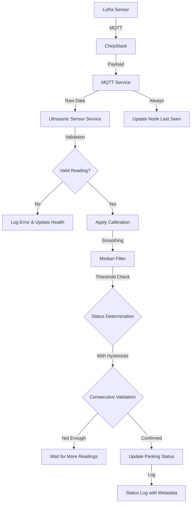

# 🚗 Smart Parking Backend System

A comprehensive Node.js + TypeScript backend for smart parking management using LoRa technology and IoT sensors.

## ✨ Features

- **🔐 Complete Authentication System** with JWT tokens
- **📧 OTP Verification** via email for user registration and password reset
- **🏢 Multi-tenant Parking Management** with floors and slots
- **📡 Real-time IoT Integration** via MQTT and LoRa
- **📊 Swagger API Documentation** with interactive testing
- **🛡️ Security Features** including CORS, Helmet, and role-based access control
- **📝 Comprehensive Logging** and audit trails
- **🧪 Testing Suite** for all authentication endpoints

## 🚀 Quick Start

### Prerequisites

- Node.js 18+ 
- PostgreSQL 12+
- npm or yarn

### Installation

1. **Clone the repository**
   ```bash
   git clone <your-repo-url>
   cd smart-parking-backend
   ```

2. **Install dependencies**
   ```bash
   npm install
   ```

3. **Environment Configuration**
   ```bash
   cp env.example .env
   ```
   
   Update `.env` with your configuration:
   ```env
   # Database
   DB_HOST=localhost
   DB_PORT=5432
   DB_USERNAME=postgres
   DB_PASSWORD=your_password
   DB_NAME=smart_parking
   
   # JWT
   JWT_SECRET=your_super_secret_jwt_key_here_make_it_long_and_random
   
   # Server
   PORT=3000
   NODE_ENV=development
   
   # Email (optional for development)
   EMAIL_SERVICE=gmail
   EMAIL_USER=your_email@gmail.com
   EMAIL_PASSWORD=your_app_password
   ```

4. **Database Setup**
   ```bash
   # Create PostgreSQL database
   createdb smart_parking
   
   # Run migrations (TypeORM will auto-sync in development)
   npm run dev
   ```

5. **Start the server**
   ```bash
   npm run dev
   ```

## 📚 API Documentation

### Authentication Endpoints

#### 1. User Registration
```http
POST /api/auth/signup
Content-Type: application/json

{
  "email": "user@example.com",
  "password": "password123",
  "firstName": "John",
  "lastName": "Doe",
  "role": "user"
}
```

**Response:**
```json
{
  "success": true,
  "message": "User created successfully. OTP sent for verification.",
  "data": {
    "id": 1,
    "email": "user@example.com",
    "firstName": "John",
    "lastName": "Doe",
    "role": "user",
    "isVerified": false,
    "createdAt": "2024-01-01T00:00:00.000Z"
  }
}
```

#### 2. User Login
```http
POST /api/auth/login
Content-Type: application/json

{
  "email": "user@example.com",
  "password": "password123"
}
```

**Response:**
```json
{
  "success": true,
  "message": "Login successful",
  "data": {
    "user": {
      "id": 1,
      "email": "user@example.com",
      "firstName": "John",
      "lastName": "Doe",
      "role": "user",
      "isVerified": true
    },
    "token": "eyJhbGciOiJIUzI1NiIsInR5cCI6IkpXVCJ9..."
  }
}
```

#### 3. Email Verification
```http
POST /api/auth/verify-otp
Content-Type: application/json

{
  "email": "user@example.com",
  "otp": "123456"
}
```

#### 4. Password Reset Request
```http
POST /api/auth/forgot-password
Content-Type: application/json

{
  "email": "user@example.com"
}
```

#### 5. Password Reset
```http
POST /api/auth/reset-password
Content-Type: application/json

{
  "email": "user@example.com",
  "otp": "123456",
  "newPassword": "newpassword123"
}
```

#### 6. Resend OTP
```http
POST /api/auth/resend-otp
Content-Type: application/json

{
  "email": "user@example.com",
  "purpose": "verification"
}
```

#### 7. Get OTP Configuration (Admin Only)
```http
GET /api/auth/otp-config
Authorization: Bearer <your-jwt-token>
```

## 🔧 OTP Configuration

The system includes a configurable OTP service with the following settings:

```typescript
interface OTPConfig {
  length: number;                    // OTP length (default: 6)
  expiryMinutes: number;            // OTP expiry time (default: 15)
  maxAttempts: number;              // Max failed attempts (default: 3)
  resendCooldownMinutes: number;    // Cooldown between resends (default: 1)
}
```

### Default Configuration
- **OTP Length**: 6 digits
- **Expiry Time**: 15 minutes
- **Max Attempts**: 3
- **Resend Cooldown**: 1 minute

## 📧 Email Service

### Development Mode
In development, emails are logged to the console with beautiful HTML templates.

### Production Mode
Configure Hostinger SMTP in `.env`:
```env
# Hostinger SMTP Configuration
SMTP_HOST=smtp.hostinger.com
SMTP_PORT=587
EMAIL=tag@thingslinker.com
EMAIL_PASSWORD=94Thingslinker94$
DEFAULT_EMAIL=tag@thingslinker.com
```

### Supported Email Services
- **Hostinger SMTP** (configured)
- Gmail (with App Password)
- SendGrid
- Nodemailer (SMTP)

## 🧪 Testing

### Run All Tests
```bash
# Test authentication system
node test-auth.js

# Test email service specifically
node test-email.js

# Test unverified user handling
node test-unverified-user.js

# Test subscription system
node test-subscription.js
```

### Manual Testing
1. Start the server: `npm run dev`
2. Check server console for OTP codes
3. Use the test script or test manually via Swagger UI
4. Test email service with: `node test-email.js`

### Test Coverage
- ✅ User registration with OTP
- ✅ Email verification flow
- ✅ Login authentication
- ✅ Password reset flow
- ✅ OTP resend functionality
- ✅ **Unverified user handling** (re-registration & recovery)
- ✅ **Subscription & Payment System**
- ✅ Rate limiting
- ✅ Input validation
- ✅ Error handling

## 🏗️ System Architecture

```
┌─────────────────┐    ┌─────────────────┐    ┌─────────────────┐
│   Frontend      │    │   Backend API   │    │   PostgreSQL    │
│   (React/Vue)   │◄──►│   (Express)     │◄──►│   Database      │
└─────────────────┘    └─────────────────┘    └─────────────────┘
                                │
                                ▼
                       ┌─────────────────┐
                       │   MQTT Service  │
                       │   (LoRa/IoT)    │
                       └─────────────────┘
                                │
                                ▼
                       ┌─────────────────┐
                       │ Subscription    │
                       │ & Payment      │
                       │ System         │
                       └─────────────────┘
```

## 🔐 Security Features

- **JWT Authentication** with configurable expiry
- **Password Hashing** using bcrypt
- **CORS Protection** with whitelist
- **Security Headers** via Helmet
- **Role-based Access Control** (RBAC)
- **Input Validation** and sanitization
- **Rate Limiting** for OTP requests

## 📊 Database Schema & Hierarchy

### Enforced Hierarchy Structure
The system enforces a strict hierarchy to ensure data consistency:

```
User (Admin) → ParkingLot → Floor → ParkingSlot → Node
```

**Key Constraints:**
- ✅ **Nodes MUST belong to a ParkingSlot** (cannot exist independently)
- ✅ **ParkingSlots MUST belong to a Floor**
- ✅ **Floors MUST belong to a ParkingLot**  
- ✅ **ParkingLots MUST belong to a User (Admin)**

### Core Entities
- **User**: Authentication and user management
- **ParkingLot**: Parking facility management (owned by Admin)
- **Floor**: Multi-level parking support (belongs to ParkingLot)
- **ParkingSlot**: Individual parking spaces (belongs to Floor)
- **Node**: IoT sensor devices (belongs to ParkingSlot) - **HIERARCHY ENFORCED**
- **Gateway**: LoRa network gateways (linked to Admin)
- **ParkingStatusLog**: Real-time status tracking

### Subscription & Payment Entities
- **SubscriptionPlan**: Predefined pricing tiers with features and limits
- **Subscription**: User's active subscription with billing cycles and status
- **Payment**: Payment transaction records and gateway integration

## 🚀 Deployment

### Production Build
```bash
npm run build
npm start
```

### Environment Variables
Ensure all production environment variables are set:
- Database credentials
- JWT secret
- Email service configuration
- MQTT broker settings

### Docker Support
```dockerfile
FROM node:18-alpine
WORKDIR /app
COPY package*.json ./
RUN npm ci --only=production
COPY dist ./dist
EXPOSE 3000
CMD ["node", "dist/index.js"]
```

## 🏗️ Node Management with Hierarchy Enforcement

### Important Changes
**⚠️ BREAKING CHANGE**: Node creation has been restructured to enforce the parking hierarchy.

### Old vs New API Structure

#### ❌ OLD (Deprecated):
```http
POST /api/nodes
{
  "gatewayId": "...",
  "chirpstackDeviceId": "...",
  "name": "..."
}
```

#### ✅ NEW (Hierarchy Enforced):
```http
POST /api/nodes/parking-slot/{parkingSlotId}
{
  "gatewayId": "...",
  "chirpstackDeviceId": "...", 
  "name": "..."
}
```

### Node Creation API Examples

#### 1. Create Node for Parking Slot
```http
POST /api/nodes/parking-slot/a1b2c3d4-e5f6-7890-abcd-ef1234567890
Authorization: Bearer <admin-jwt-token>
Content-Type: application/json

{
  "gatewayId": "gateway-uuid-here",
  "chirpstackDeviceId": "sensor_001", 
  "name": "Parking Sensor A1",
  "description": "Ultrasonic sensor for slot A1",
  "latitude": 40.7128,
  "longitude": -74.0060,
  "metadata": {
    "sensorType": "ultrasonic",
    "range": "4m",
    "frequency": "915MHz"
  }
}
```

**Success Response (201):**
```json
{
  "success": true,
  "message": "Node created successfully with enforced hierarchy",
  "data": {
    "id": "node-uuid-here",
    "chirpstackDeviceId": "sensor_001",
    "name": "Parking Sensor A1",
    "description": "Ultrasonic sensor for slot A1",
    "latitude": 40.7128,
    "longitude": -74.0060,
    "isActive": true,
    "metadata": {
      "sensorType": "ultrasonic",
      "range": "4m",
      "frequency": "915MHz"
    },
    "gateway": {
      "id": "gateway-uuid-here",
      "name": "Main Building Gateway",
      "chirpstackGatewayId": "gateway_001"
    },
    "parkingSlot": {
      "id": "slot-uuid-here",
      "name": "A1",
      "floor": {
        "id": "floor-uuid-here",
        "name": "Ground Floor",
        "parkingLot": {
          "id": "lot-uuid-here",
          "name": "Main Parking Building"
        }
      }
    },
    "createdAt": "2024-01-01T12:00:00.000Z"
  },
  "hierarchy": {
    "node": "Parking Sensor A1",
    "slot": "A1", 
    "floor": "Ground Floor",
    "lot": "Main Parking Building"
  }
}
```

**Error Responses:**

Parking slot already has a node (400):
```json
{
  "success": false,
  "message": "Parking slot already has a node assigned"
}
```

Access denied - not your parking lot (403):
```json
{
  "success": false,
  "message": "Access denied: You do not own this parking lot"
}
```

Parking slot not found (404):
```json
{
  "success": false,
  "message": "Parking slot not found"
}
```

Gateway not found or not linked (404):
```json
{
  "success": false,
  "message": "Gateway not found or not linked to your account"
}
```

Duplicate chirpstack device ID (400):
```json
{
  "success": false,
  "message": "Node with this ChirpStack device ID already exists"
}
```

### Hierarchy Validation
The API automatically validates the complete hierarchy:
1. ✅ **Parking Slot exists** and belongs to your parking lot
2. ✅ **Gateway exists** and is linked to your admin account  
3. ✅ **Parking Slot is available** (no existing node)
4. ✅ **ChirpStack Device ID is unique** across all nodes
5. ✅ **Admin owns the parking lot** (hierarchy access control)

### Other Node Endpoints

#### Get All My Nodes
```http
GET /api/nodes
Authorization: Bearer <admin-jwt-token>
```

#### Get Nodes by Gateway
```http
GET /api/nodes/gateway/{gatewayId}
Authorization: Bearer <admin-jwt-token>
```

#### Get Node by ID
```http
GET /api/nodes/{nodeId}
Authorization: Bearer <admin-jwt-token>
```

#### Update Node
```http
PUT /api/nodes/{nodeId}
Authorization: Bearer <admin-jwt-token>
Content-Type: application/json

{
  "name": "Updated Sensor Name",
  "description": "Updated description",
  "latitude": 40.7129,
  "longitude": -74.0061,
  "metadata": {
    "batteryLevel": 85,
    "rssi": -65
  },
  "isActive": true
}
```

#### Delete Node
```http
DELETE /api/nodes/{nodeId}
Authorization: Bearer <admin-jwt-token>
```

**⚠️ Note**: You cannot delete a node that is assigned to a parking slot. The hierarchy enforcement prevents orphaned relationships.

#### Update Node Status (IoT/Webhook)
```http
PUT /api/nodes/{nodeId}/status
Authorization: Bearer <admin-jwt-token>
Content-Type: application/json

{
  "lastSeen": "2024-01-01T12:00:00.000Z",
  "metadata": {
    "batteryLevel": 85,
    "rssi": -65,
    "temperature": 25.5,
    "sensorStatus": "active"
  }
}
```

### Removed/Deprecated Endpoints
The following endpoints have been **removed** due to hierarchy enforcement:

- ❌ `GET /api/nodes/unassigned` - All nodes are now always assigned
- ❌ `POST /api/nodes/{id}/assign-parking-slot` - Assignment happens during creation
- ❌ `DELETE /api/nodes/{id}/unassign-parking-slot` - Cannot unassign due to hierarchy

## 📝 API Documentation

Interactive API documentation is available at:
- **Swagger UI**: `http://localhost:3000/api-docs`
- **API Base**: `http://localhost:3000/api`

## 🤝 Contributing

1. Fork the repository
2. Create a feature branch
3. Make your changes
4. Add tests
5. Submit a pull request

## 📄 License

This project is licensed under the MIT License.

## 🆘 Support

For support and questions:
- Check the API documentation
- Review the test files
- Open an issue on GitHub

# 📡 Ultrasonic Sensor Management

The system includes a sophisticated ultrasonic sensor management system with dynamic range handling, automatic calibration, and robust error handling to ensure accurate parking slot detection.

## 🎯 Key Features

- **✅ Dynamic Range Management**: Automatically adjusts to different sensor ranges and parking slot sizes
- **✅ Threshold-based Detection**: Configurable thresholds for occupied/vacant status with hysteresis
- **✅ Smart Smoothing**: Noise reduction through median filtering and consecutive reading validation
- **✅ Auto-Calibration**: Automatic sensor calibration using empty slot readings
- **✅ Error Handling**: Comprehensive validation and fault detection
- **✅ Health Monitoring**: Real-time sensor health tracking and diagnostics
- **✅ Multiple Payload Formats**: Support for various LoRa payload formats

## 🔧 Configuration Parameters

### Default Sensor Configuration
```json
{
  "sensorType": "ultrasonic",
  "maxRange": 400,              // 4m maximum range
  "minRange": 5,                // 5cm minimum range  
  "occupiedThreshold": 80,      // Car detected if distance < 80cm
  "vacantThreshold": 120,       // Slot vacant if distance > 120cm
  "hysteresis": 10,             // 10cm margin to prevent oscillation
  "smoothingWindow": 5,         // Average over 5 readings
  "validationThreshold": 2,     // Require 2 consecutive readings
  "calibrationOffset": 0,       // No default calibration offset
  "errorThreshold": 5           // 5 consecutive errors = sensor fault
}
```

### Parameter Explanations

- **Range Settings**: Define the valid detection range for the ultrasonic sensor
- **Thresholds**: Critical distances that determine parking status
- **Hysteresis**: Prevents rapid status changes due to minor distance variations
- **Smoothing**: Reduces noise by averaging multiple readings
- **Validation**: Ensures status changes are confirmed by multiple consecutive readings
- **Calibration**: Accounts for environmental factors and sensor mounting differences

## 📋 Sensor API Endpoints

### 1. Get Sensor Configuration
```http
GET /api/sensors/nodes/{nodeId}/config
Authorization: Bearer {admin-token}
```

**Response:**
```json
{
  "success": true,
  "data": {
    "nodeId": "uuid",
    "chirpstackDeviceId": "sensor_001",
    "config": {
      "sensorType": "ultrasonic",
      "maxRange": 400,
      "occupiedThreshold": 80,
      "vacantThreshold": 120
    },
    "stats": {
      "readingCount": 150,
      "currentStatus": "vacant"
    }
  }
}
```

### 2. Update Sensor Configuration
```http
PUT /api/sensors/nodes/{nodeId}/config
Authorization: Bearer {admin-token}
Content-Type: application/json

{
  "maxRange": 350,
  "occupiedThreshold": 70,
  "vacantThreshold": 130,
  "hysteresis": 15,
  "smoothingWindow": 7
}
```

### 3. Calibrate Sensor
```http
POST /api/sensors/nodes/{nodeId}/calibrate
Authorization: Bearer {admin-token}
Content-Type: application/json

{
  "emptySlotReadings": [180, 175, 182, 178, 179, 181, 176, 183, 177, 180]
}
```

### 4. Test Sensor Processing
```http
POST /api/sensors/nodes/{nodeId}/test
Authorization: Bearer {admin-token}
Content-Type: application/json

{
  "distance": 85,
  "batteryLevel": 75,
  "temperature": 25,
  "rssi": -65
}
```

### 5. Get Sensor Health
```http
GET /api/sensors/nodes/{nodeId}/health
Authorization: Bearer {admin-token}
```

**Response:**
```json
{
  "success": true,
  "data": {
    "health": {
      "score": 85,
      "status": "good",
      "issues": ["Low battery level"]
    },
    "stats": {
      "isOnline": true,
      "batteryLevel": 25,
      "readingCount": 247,
      "currentStatus": "occupied"
    }
  }
}
```

## 🧪 Testing the Sensor System

### Run Comprehensive Tests
```bash
# Install dependencies (if not already done)
npm install axios

# Run the ultrasonic sensor test suite
node test-ultrasonic-sensors.js
```

The test suite validates:
- ✅ Configuration management
- ✅ Sensor calibration
- ✅ Status detection with various distances
- ✅ Consecutive reading validation
- ✅ Health monitoring
- ✅ Error handling
- ✅ Reset functionality

### Manual Testing Examples

#### 1. Configure for Compact Cars (Lower Profile)
```bash
curl -X PUT http://localhost:3000/api/sensors/nodes/{nodeId}/config \
  -H "Authorization: Bearer {token}" \
  -H "Content-Type: application/json" \
  -d '{
    "occupiedThreshold": 60,
    "vacantThreshold": 100,
    "hysteresis": 8
  }'
```

#### 2. Configure for Large Vehicles (Higher Profile)
```bash
curl -X PUT http://localhost:3000/api/sensors/nodes/{nodeId}/config \
  -H "Authorization: Bearer {token}" \
  -H "Content-Type: application/json" \
  -d '{
    "occupiedThreshold": 100,
    "vacantThreshold": 150,
    "hysteresis": 12
  }'
```

#### 3. Calibrate for Outdoor Parking (High Ceiling)
```bash
curl -X POST http://localhost:3000/api/sensors/nodes/{nodeId}/calibrate \
  -H "Authorization: Bearer {token}" \
  -H "Content-Type: application/json" \
  -d '{
    "emptySlotReadings": [300, 295, 305, 298, 302, 297, 301, 299, 304, 296]
  }'
```

## 📊 Sensor Data Flow



## 🔍 Troubleshooting Common Issues

### Problem: Sensor shows wrong status frequently
**Solutions:**
1. **Increase hysteresis margin**: Prevents oscillation between states
2. **Adjust smoothing window**: More readings = more stable but slower response
3. **Check sensor mounting**: Ensure proper alignment and no obstructions
4. **Recalibrate**: Use fresh empty slot readings

### Problem: Slow response to parking changes  
**Solutions:**
1. **Reduce validation threshold**: Faster confirmation but less reliable
2. **Reduce smoothing window**: Faster response but more noise sensitive
3. **Adjust thresholds**: Ensure adequate separation between occupied/vacant

### Problem: High error rates
**Solutions:**
1. **Check power supply**: Low battery affects sensor accuracy
2. **Verify mounting**: Sensor should be perpendicular to ground
3. **Update range settings**: Ensure they match physical installation
4. **Check for obstructions**: Remove any objects blocking sensor

### Problem: Inconsistent readings in weather
**Solutions:**
1. **Increase smoothing**: Better noise filtering
2. **Adjust for temperature**: Consider temperature compensation
3. **Update calibration**: Recalibrate for seasonal changes
4. **Check sensor housing**: Ensure weather protection

## 📈 Monitoring and Analytics

### Key Metrics to Track
- **Health Score**: Overall sensor operational status
- **Reading Frequency**: How often sensors report data
- **Battery Levels**: Proactive maintenance scheduling
- **Error Rates**: Identify problematic sensors
- **Confidence Scores**: Status determination reliability
- **Status Change Frequency**: Parking slot utilization patterns

### Database Schema Enhancement
The system stores enhanced sensor data:
- **Node.metadata**: Real-time sensor data (distance, battery, RSSI)
- **ParkingStatusLog.metadata**: Historical sensor readings with confidence scores
- **Configuration tracking**: All sensor parameter changes are logged

## 🔄 System Integration

### LoRa Payload Formats Supported

#### Format 1: Binary (2+ bytes)
```
Byte 0-1: Distance (16-bit, big-endian)
Byte 2:   Battery Level (0-100%)  
Byte 3:   Temperature (signed 8-bit, Celsius)
```

#### Format 2: JSON
```json
{
  "distance": 85,
  "battery": 75,
  "temperature": 22
}
```

#### Format 3: Legacy (1 byte)
```
Byte 0: Distance (8-bit, 0-255cm)
```

## 🔮 Roadmap

- [ ] WebSocket support for real-time updates
- [ ] Mobile app API endpoints  
- [ ] Advanced analytics and reporting
- [ ] Payment integration
- [ ] Multi-language support
- [x] **Advanced IoT device management with ultrasonic sensors**
- [ ] Machine learning for predictive maintenance
- [ ] Multi-sensor fusion (ultrasonic + magnetic + camera)
- [ ] Weather-based threshold adjustment
- [ ] Automated sensor fault detection and alerts

---

**Built with ❤️ for smart city solutions**
